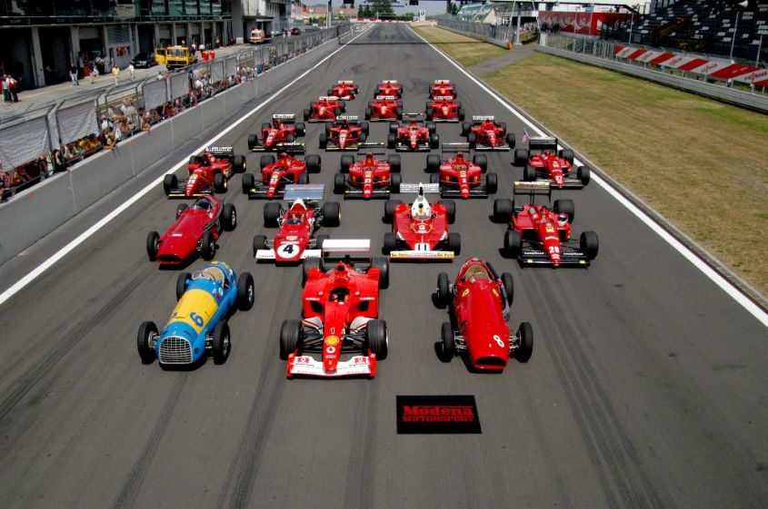
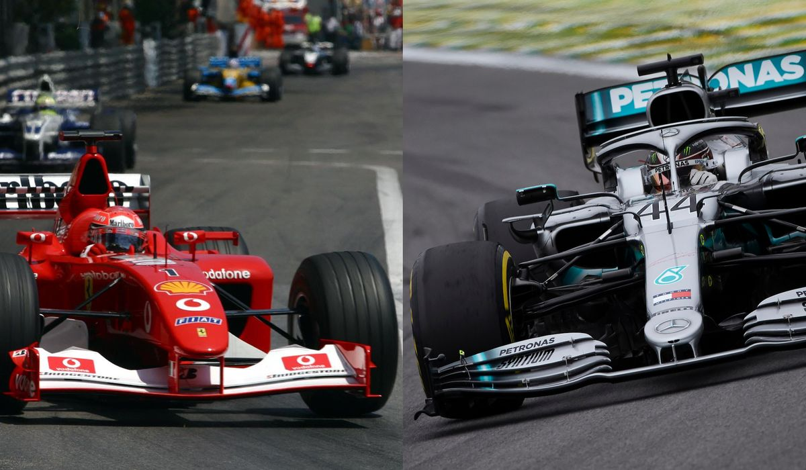

```{r setup, include=FALSE}
knitr::opts_chunk$set(cache= TRUE, message = FALSE, warning = FALSE)

#librerie in programma 
library(dplyr)
library(ggplot2)
library(readr)

#librerie aggiuntive
library(gridExtra) #Libreria che fornisce grafiche a griglia, con la possibilità di aggiungere più grafici in uno solo "foglio"
library(ggthemes) #Temi aggiuntivi alla libreria ggplot2
library(RColorBrewer) #Forsnice colori per i grafici
library(grid) #Fornisce grafiche a griglia per un solo grafico
library(ggrepel) #Fornisce testo ed etichette aggiuntive alla libreria ggplot2 che aiutano ad evitare la sovrapposizione del testo
library(viridis) #palette di colori aggiuntiva a ggplot2
library(circlize) #libreria che rende possibile ottenere grafici circolari con una vasta quantità di dati
```

# Introduzione

```{r, message=FALSE, warning=FALSE,echo=FALSE}
#carico: Risultati
results<- read_csv("results.csv")
results$fastestLapSpeed<-as.numeric(results$fastestLapSpeed) #converto il valore da carattere a numerico

#carico: gare e circuiti
races<-read_csv("races.csv")
races$date<-as.Date(races$date,"%Y-%m-%d") #converto il tipo carattere in Data
races$name<-gsub(" Grand Prix","",races$name) #rimuovo  "Grand Prix" nel nome

results_2<-left_join(
  results %>% select(-time, -fastestLapTime), 
  races %>% select(-time, -url), 
  by='raceId')

#carico: cicuiti
circuits<-read_csv("circuits.csv")
races<-left_join(races %>% select(-name,-url), circuits %>% select(-url), by='circuitId')
```

## Introduzione
 <div style="text-align:center"></div>

Nella storia della Formula 1, le vetture hanno segnato diverse epoche. Sia per quanto riguarda la parte estetica, sia per le prestazioni. I motori sono una delle componenti più soggette a cambiamenti, e ciò ha fatto sì che caraterizzassero diversi decenni: 

> 1. Agli inizi anni '50 introdussero i motori aspirati;
> 1. Poco prima degli anni '80 si passò ai motori turbo;
> 1. Nel 1989 vennero imposte limitazioni dalla FIA ai motori turbo;
> 1. Dagli anni '90 fino ai primi anni '00, si svilupparono i motori turbo-aspirati (V8,V10);
> 1. Nel 2009 ci fu l'introduzione del "KERS", un passo verso l'ibrido;
> 1. 2014: motori termo-elettrici. Passaggio ufficiale all'era "ibrida" (MGU-K e MGU-U).

# Come sono cambiate le velocità delle vetture negli anni?

## Prima Osservazione

Grafico della velocità media nei giri veloci:

```{r, message=FALSE, warning=FALSE,echo=FALSE}
#Media delle velocità per gran premio dal 2003-2020
#Osservare in particolare: 2009 e 2014. Inoltre osserva "anomalie, tipo gran premio di Spagna"
#analizzo la feature "FastestLapSpeed"

results_2 %>% 
filter(year>2003) %>% 
  group_by(name,year) %>% 
  summarize(medianFastestLapSpeed = median(fastestLapSpeed,na.rm=T)) %>% 
  ggplot(aes(x=factor(year),y= medianFastestLapSpeed,color=medianFastestLapSpeed)) + 
  geom_point() + theme_fivethirtyeight() + 
  scale_color_gradientn(name="",colours=rev(magma(10))) +
  theme(
    axis.text.x = element_text(size=5,angle=90),
    strip.text.x = element_text(size = 5)) + facet_wrap(~name,ncol=10) + 
  labs(title='Velocità media nei giri veloci per circuito: 2004-2020',
       subtitle='velocità in km/h') +
  guides(color=FALSE)

#COMMENTARE IL PLOT OTTENUTO
```

Dal grafico si nota che: 

> 1. Le velocità medie nei giri, per i diversi circuiti, sono calate di prestazione fino al 2013 circa;
> 1. Dal 2014 c'è stato un lieve incremento della velocità media; 
> 1. Nel circuito di Spagna c'è un calo costante della velocità, dovuto ad una variazione del tracciato nel 2007.

**Da una prima analisi sembra che il motore "ibrido" sia la ragione del lieve aumento delle prestazioni delle vetture.**

Nota: Dal 1950 fino al 2003, non c'è stato un numero significativo di dati. Pertanto quel periodo è stato rimosso.


## Distribuzione della velocità per anno

Si osserva la distribuzione della velocità media raggruppata per anno: 

```{r, message=FALSE, warning=FALSE,echo=FALSE}

#visualizzazione più chiara con la distribuzoine

results_2 %>% 
filter(year>2003) %>% 
  group_by(name,year) %>% 
  summarize(medianFastestLapSpeed = median(fastestLapSpeed,na.rm=T)) %>% 
  ggplot(aes(x=factor(year),y= medianFastestLapSpeed,color=medianFastestLapSpeed)) + 
  geom_boxplot(alpha=.25) + theme_fivethirtyeight() + 
  geom_jitter(shape=16,position=position_jitter(0.2),size=1.5) + 
  geom_smooth(method='loess',aes(group=1),color='red',lty=2,size=.5) +
  scale_color_gradientn(name="",colours=rev(magma(20))) + 
  labs(title='Velocità media dei giri veloci per anno: 2004-2020',
       subtitle='velocità in km/h, raggruppate per anno') + 
  guides(color = FALSE)

```

Il grafico ottenuto conferma l'ipotesi fatta in precedenza. La media delle velocità per anno presenta un andamento decrescente fino al 2014, mentre negli anni successivi aumenta costantemente.

# Qual è la scuderia con più vittorie? Ci sono state epoche in cui una scuderia ha prevalso rispetto alle altre?

## Scuderie

Nel grafico è rappresentata la frequenza delle vittorie per scuderia:

```{r, message=FALSE, warning=FALSE,echo=FALSE}
#carico: costruttori
constructors<- read_csv("constructors.csv")
constructorStandings<- read_csv("constructor_standings.csv") 
constructorResults<- read_csv("constructor_results.csv")  

constructorResults<-left_join(
  constructorResults, 
  races %>% rename(name_races = name), by='raceId')

constructorResults <- left_join(constructorResults, constructors %>% select(-url) %>% rename(name_constructor = name), by='constructorId')

constructorResults <- left_join(constructorResults, constructorStandings %>% rename(point_constructor = points), by=c('constructorId','raceId'))

#*non sono considerate le scuderie che non hanno vinto nessuna gara*
vittorieScuderie<-constructorResults %>% 
  filter(wins == 1) %>% 
  group_by(name_constructor) %>% 
  summarize(count=n()) %>% 
  filter(count>0) %>%
  ggplot(aes(x=reorder(name_constructor, count),y= count,fill=count)) +
  geom_bar(stat='identity',color='white',size=.1) + 
  coord_flip() + theme_fivethirtyeight() + 
  scale_fill_gradientn(name="",colors = magma(10)) +
  guides(fill=guide_legend(ncol=3)) + 
  theme(legend.text= element_text(size=10),
        legend.key.size = unit(.05, "cm"),
        legend.position=c(.65,.20)) + 
  labs(title="Numero di vittorie per scuderia",
       subtitle="Scuderie con una o più vittorie") + guides(fill=F)

#GRAFICO DELLE DISTRIBUZIONE DI FREQUENZA DELLE VITTORIE PER SCUDERIA 
vittorieScuderie
```

Dal grafico si osserva che:

> 1. La scuderia **più vincente** in assoluto è la **Ferrari**, con oltre 150 vittorie;
> 1. Le scuderie McLaren e Williams vantano un numero di vittorie superiore a 100, risultando rispettivamente al secondo e terzo posto;
> 1. La Mercedes, entrata in Formula1 nel 2009, si colloca all'undicesimo posto per numero di vittorie. 

**Nonostante la recente entrata in Formula 1, la scuderia Mercedes è riuscita a distinguersi  positivamente circa al numero di vittorie**

## Top 5 scuderie + Mercedes

Per questa analisi, ho estrapolato dal grafico precedente 6 scuderie:

> 1. Ferrari
> 1. McLaren
> 1. Williams
> 1. Brabham
> 1. BRM
> 1. Mercedes

Si vuole osservare il numero di vittorie delle scuderie negli anni:

```{r, message=FALSE, warning=FALSE,echo=FALSE}

#TOP 5 + MERCEDES SCUDERIE
topScuderie<-constructorResults %>% 
  filter(name_constructor %in% c('Williams','McLaren','Ferrari','Brabham','BRM','Mercedes')) %>% 
  filter(wins == 1) %>% group_by(name_constructor,year) %>%
  summarize(count=n()) %>% 
  ggplot(aes(x=factor(year),y=count)) +
  geom_histogram(aes(fill=name_constructor),
                 stat='identity',
                 position="fill",
                 size=1.5) + 
  theme_fivethirtyeight() + scale_fill_brewer(name="",palette='Set3') +
  theme(axis.text.x = element_text(size=8,angle=270)) + ggtitle("Scuderie con maggiori vittorie nelle diverse epoche")


#GRAFICO DELLE TOP 5 SCUDERIE CHE HANNO VINTO DI PIU'
topScuderie

```

Si osserva che le vittorie delle scuderie sono concentrate maggiormente in alcuni decenni:

> 1. Negli anni ’60 la BRM ha prevalso;
> 1. Negli anni '70 e ’80 invece la McLaren e la Williams presentano una gran densità di vittorie. Pertanto si sono distinte rispetto alle altre; 
> 1. Il dominio della **Ferrari** va dai primi anni **’90 fino al 2005**; 
> 1. Infine nell'era moderna, prevale la scuderia **Mercedes**. 

Un piccolo appunto bisgogna farlo sulla scuderia Ferrari che, praticamente ogni anno, presenta almeno una minima percentuale di vittorie.

# Quali sono i piloti più vincenti?

## Piloti

Per rispondere alla domanda, ho analizzato la frequenza assoluta delle vittorie dei piloti:

```{r, message=FALSE, warning=FALSE,echo=FALSE}
#carico: piloti
drivers<-read_csv("drivers.csv")
driversStandings<-read_csv("driver_standings.csv")
drivers<-left_join(drivers %>% select(-url), driversStandings,by='driverId')

results_3<-left_join(
  results, 
  drivers %>% rename(number_drivers = number) %>% select(-points, -position, -positionText),
  by=c('driverId','raceId')) 

results_3<-left_join(results_3,races %>% select(-time), by='raceId')

#vittorie piloti

results_3 %>% 
  filter(position==1) %>% 
  group_by(driverRef, circuitRef) %>% 
  summarize(count=n()) %>%
  mutate(allWins = sum(count)) %>% 
  filter(allWins>8) %>%
  ggplot(aes(x=reorder(driverRef, allWins),y= count)) +
  geom_bar(aes(fill=circuitRef),stat='identity',color='white',size=.1) + 
  coord_flip() + theme_fivethirtyeight() + 
  scale_fill_manual(name="",values = magma(71)) +
  guides(fill=guide_legend(ncol=3.5)) + 
  theme(legend.text= element_text(size=5),
        legend.key.size = unit(.1, "cm"),
        legend.position=c(.75,.35)) + 
  labs(title="Numero di vittorie per pilota",
       subtitle="piloti con più di 8 vittorie")
#GRAFICO DEI PILOTI CON PIU' VITTORIE (commentare)
```

> 1. Con i dati aggiornati al 2018/2019 il pilota più vincente in assoluto è **Michael Schumacher** con 91 vittorie;
> 1. Al secondo posto si trova **Lewis Hamilton** con un numero di vittorie leggermente inferiore a Schumacher; 
> 1. Al terzo posto, con un distacco significativo rispetto al secondo pilota più vincente, si posiziona **Prost**. 

Salta all'occhio che, dal terzo pilota in poi, la differenza del numero di vittorie rispetto al pilota successivo non è così eccessiva rispetto al distacco che presentano i primi due dal terzo.

**Come si distribuiscono le vittorie dei piloti negli anni?**

## Top 10 piloti

Ho analizzato i 10 piloti più vincenti negli anni:

```{r, message=FALSE, warning=FALSE,echo=FALSE}

temp<-(results_3 %>% filter(position==1) %>% group_by(driverRef) %>% summarize(count=n()) %>% arrange(-count) %>% top_n(10))$driverRef
results_3$top10<-ifelse(results_3$driverRef %in% temp,results_3$driverRef,'other')

results_3 %>% filter(position==1) %>% group_by(top10,year) %>% 
  summarize(count=n()) %>% filter(count>0 & year>=1960) %>% 
  ggplot(aes(x=factor(year),y=count)) + 
  geom_histogram(aes(fill=top10),position="fill",stat='identity') + 
  theme_fivethirtyeight() + 
  theme(legend.position='bottom',
        axis.text.x = element_text(size=8,angle=270)) +
  scale_fill_brewer(name="",palette='Set3')+
  guides(fill=guide_legend(ncol=10)) + 
  labs(title='Vittorie dei piloti negli anni',
       subtitle='mostrati solo i 10 piloti più vincenti')
```

Risulta che:

> 1. Negli anni ’60 ci fu il dominio di Clarck; 
> 1. Negli anni ’70, toccò a Jackie Stewart;
> 1. Alla fine degli anni ’70, il testimone passò a Niki Lauda;
> 1. Tra gli anni ’80 e gli inizi dei ’90, ci fu una battaglia continua fra tre grandi nomi: Alain Prost, Ayrton Senna e Nigel Mansell;
> 1. A dominare gli anni ’90 e ’00, invece, è Michael Schumacher;
> 1. Dal 2004 fino al 2013, ci furono Alonso, Vettel e Hamilton;
> 1. Dal 2014, Hamilton sta dominando l’era del motore ibrido.


È curioso come Schumacher e Hamilton siano vincenti negli stessi periodi in cui le scuderie Ferrari e Mercedes sono risultate vincenti nei grafici precedenti.

**Per vincere così tanto, con che scuderie hanno corso?**

# Schumacher e Hamilton

## Michael Schumacher 

```{r, message=FALSE, warning=FALSE,echo=FALSE}
results_4<-
  left_join(
    results %>% select(-time) %>% rename(number_results = number), 
    drivers %>% select(-points,-position,-positionText) %>% rename(number_drivers = number, driver_nationality = nationality),by=c('driverId','raceId')) %>% 
  left_join(constructorResults %>% select(-points, -position, -positionText) %>% rename(wins_constructor = wins, nationality_constructor = nationality), by=c('raceId','constructorId'))
```

```{r, message=FALSE, warning=FALSE,echo=FALSE}
Schumacher<- results_4 %>% filter(driverRef == 'michael_schumacher') %>% 
  group_by(name_constructor, year) %>% summarize(countByConstructor = n()) %>% 
  ggplot(aes(x=factor(year),y=countByConstructor,fill=name_constructor)) + 
  geom_histogram(stat='identity') + theme_fivethirtyeight() + 
  scale_fill_manual(name='',values =c(Benetton='#87CEEB',Ferrari='#EE0000',Jordan='#FFD700',Mercedes='#7F7F7F')) + 
  theme(legend.position='top',
        axis.ticks=element_blank(),
        axis.text.x=element_blank(),
        axis.title.x=element_blank()) + 
  labs(title='Michael Schumacher: Scuderie negli anni',subtitle='Numero di gare per scuderia')

garecumulateMsc<-results_4 %>% filter(driverRef == 'michael_schumacher') %>% 
  group_by(year) %>% summarize(count=n()) %>% mutate(cumulRaces = cumsum(count)) %>% 
  ggplot(aes(x=factor(year),y=cumulRaces))+ geom_histogram(stat='identity') + 
  theme_fivethirtyeight() + theme(legend.position='None')

grid.arrange(Schumacher, garecumulateMsc, ncol=1, nrow=2, heights=c(4, 2))
```

Schumacher ha corso in 4 scuderie diverse, totalizzando circa 300 presenze in Formula 1 e trascorrendo il suo periodo più lungo con Ferrari. La Scuderia Ferrari ha dominato l'epoca degli anni '90 e inizi 2000, proprio quando Schumacher guidava una delle loro monoposto.

## Lewis Hamilton

```{r, message=FALSE, warning=FALSE,echo=FALSE}
Hamilton<- results_4 %>% filter(driverRef == 'hamilton') %>% 
  group_by(name_constructor, year) %>% summarize(countByConstructor = n()) %>% 
  ggplot(aes(x=factor(year),y=countByConstructor,fill=name_constructor)) + 
  geom_histogram(stat='identity') + theme_fivethirtyeight() + 
  scale_fill_manual(name='',values =c(McLaren='#EE0000',Mercedes='#7F7F7F')) + 
  theme(legend.position='top',
        axis.ticks=element_blank(),
        axis.text.x=element_blank(),
        axis.title.x=element_blank()) + 
  labs(title='Lewis Hamilton: Scuderie negli anni',subtitle='Numero di gare per scuderia')

garecumulateH<-results_4 %>% filter(driverRef == 'hamilton') %>% 
  group_by(year) %>% summarize(count=n()) %>% mutate(cumulRaces = cumsum(count)) %>% 
  ggplot(aes(x=factor(year),y=cumulRaces))+ geom_histogram(stat='identity') + 
  theme_fivethirtyeight() + theme(legend.position='None')

grid.arrange(Hamilton, garecumulateH, ncol=1, nrow=2, heights=c(4, 2))
```

Hamilton ha corso rispettivamente con la McLaren e con la Mercedes, totalizzando poco più di 200 presenze in Formula 1. Da questa analisi si può notare che il dominio dell'era moderna della Mercedes corrisponde alla presenza del pilota nella scuderia. 

## I più vincenti
<div style="text-align:center"></div>

Dopo aver osservato la carriera di Schumacher e quella di Hamilton, si può dire che la loro presenza in una scuderia che ha dominato (sta dominando) un'epoca, ha contribuito (sta contribuendo) significativamente al loro numero elevato di vittorie. Inoltre, nella classifica dei piloti più vincenti analizzata in precedenza, si può dire che questi due piloti sono i "colossi" della Formula 1, visto il distacco nel numero di vittorie dal terzo pilota più vincente.

# I piloti vincenti sono associati a scuderie vincenti?

## Piloti e scuderie

In questa analisi ho associato il dominio delle scuderie ai piloti che ne hanno fatto parte:

```{r, message=FALSE, warning=FALSE,echo=FALSE}
results_4<-left_join(
  results_3, 
  constructorResults %>% select(-position,-positionText,-points,-country,-wins,-lng,-lat,-alt,-nationality,-circuitRef,-round, -circuitId,-year,-time,-date,-location),
  by=c('raceId','constructorId'))
temp1<-data.frame(
  results_4 %>% filter(position==1) %>% 
    group_by(name_constructor, driverRef) %>% 
    summarize(count=n()) %>% filter(count>5) %>% na.omit())
```
```{r, message=FALSE, warning=FALSE,echo=FALSE}
#preparazione dei colori per il grafico
names<-sort(unique(temp1$name_constructor))
color <- c('#87CEEB',"gray50","gray50","#FFFFE0","gray50","#006400",'#EE0000','#1E90FF','gray50','#006400','#7F7F7F','#7F7F7F','#9C661F','#FFD700','gray50','gray50','#EEEEE0')
COL<-data.frame(name_constructor = names,color)
temp2<-data.frame(left_join(temp1, COL, by='name_constructor'))
```
```{r echo=FALSE, message=FALSE, warning=FALSE}
chordDiagram(temp2[,c(1:2)],transparency = 0, col= as.character(temp2$color),annotationTrack = "grid", preAllocateTracks = 1)
#cosmetic
circos.trackPlotRegion(
  track.index = 1, 
  panel.fun = function(x, y) {
    xlim = get.cell.meta.data("xlim")
    ylim = get.cell.meta.data("ylim")
    sector.name = get.cell.meta.data("sector.index")
    circos.text(
      mean(xlim), 
      ylim[1], 
      sector.name, 
      facing = "clockwise", 
      niceFacing = TRUE, 
      adj = c(-0.35, 0.25), 
      cex=.7)
  circos.axis(
    h = "top", 
    labels.cex = 0.3, 
    major.tick.percentage = 0.2, 
    sector.index = sector.name, 
    track.index = 2)
  }, 
  bg.border = NA)
```

Dal grafico si osserva che:

> 1. Le scuderie dominanti sono: Ferrari, Williams e McLaren. Tre della top 5 analizzata in precedenza.  
> 1. Nei grafici precedenti ho verificato che fra gli anni ’80 e gli inizi dei ’90 c’è stato il dominio di Senna, Prost e Mansell. Si osserva che ognuno di essi è associato ad una macchina vincente: rispettivamente Senna e Prost con la McLaren e Mansell con la Williams.
> 1. La scuderia Mercedes che, come ricordiamo, si è inserita come scuderia poco prima dell’ultimo decennio, ora domina l’era del motore ibrido (dal 2014) e vanta la presenza di un pilota vincente come Lewis Hamilton. Pilota che ha corso anche con la scuderia McLaren, un'altra macchina vincente dominatrice negli anni.

***Questo conferma che le scuderie hanno contribuito in modo determinate al numero di vittorie dei piloti e viceversa. Confermo inoltre che, come ipotizzato inizialmente, a seconda dell'epoca e del motore utilizzato, c'è una scuderia diversa che si distingue rispetto alle altre.***